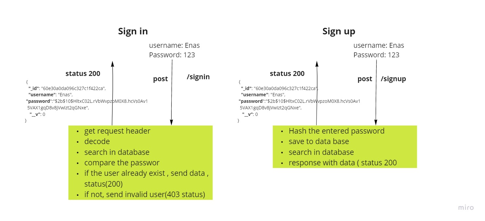

# Basic Auth

Deploying an Express server implements basic authentication, with Signin and Signup, using Mongo DB.

****

## Author

### Enas Batayneh

****

## Links

* [Pull request](https://github.com/En-ZUH/basic-auth/pulls)
* [Github Actions](https://github.com/En-ZUH/basic-auth/actions)

* [Deployed App to Heroku /production](https://basic-auth-enas.herokuapp.com/)

## Setup

* express  
* (.env) file
  * PORT
  * MONGOOSE_URI

## Dependencies needs to install

* npm init -y
* npm i dotenv express cors mongoose bacse-64 bcrypt
* npm i -D jest supertest eslint
* sudo service mongodb start

## To Run the Application

1. clone the repository
2. run the command (nodemon)

## UML Diagram

<<<<<<< HEAD
<!--  -->
=======
 
>>>>>>> 7cc0ddc8e8b64e955cff1d84dcf9f339d5d841a7

<!-- ## Testing

* test file (server.test.js)

* run the command(npm test) -->

<!--  -->
